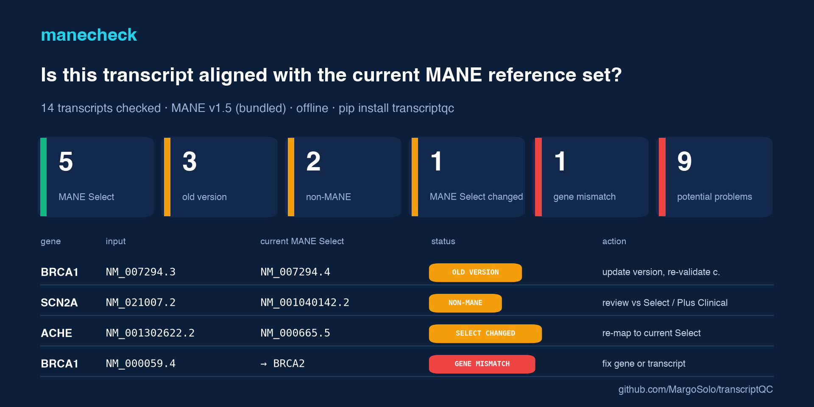

# transcriptQC · `manecheck`

[](https://pypi.org/project/transcriptqc/)
[](https://doi.org/10.5281/zenodo.22285580)
[](https://github.com/MargoSolo/transcriptQC/actions/workflows/ci.yml)




**Is this transcript aligned with the current MANE reference set?** Variant reports arrive on old or arbitrary RefSeq/Ensembl transcripts: `NM_007294.3`, `NM_021007.2`, `ENST…`. MANE is the NCBI/EMBL-EBI reference set for exactly this — **MANE Select** is one agreed transcript per gene, **MANE Plus Clinical** adds isoforms needed for known clinically relevant variants. `manecheck` compares what you were given with a versioned MANE snapshot and reports the alignment with a suggested action, one transcript or a whole lab table at a time, **offline**, from the MANE bulk files shipped inside the package. It is a reference-choice QC, not a transcript-selection policy: a non-MANE transcript can be the right choice with a documented rationale.

```bash
pip install transcriptqc
manecheck variants.csv --html report.html          # columns: gene, transcript, variant (any subset; or one HGVS column)
manecheck "NM_007294.3:c.5266dupC"
manecheck NM_021007.2 --gene SCN2A
manecheck SCN2A
```

## What it says

```
BRCA1  c.5266dupC
  Input transcript:      NM_007294.3
  Current MANE Select:   NM_007294.4
  Status:                OLD_VERSION ⚠
  Action:                update transcript version; re-validate c. position
  Note:                  current version is NM_007294.4

SCN2A  c.4766A>G
  Input transcript:      NM_021007.2
  Current MANE Select:   NM_001040142.2
  MANE Plus Clinical:    NM_001371246.1
  Status:                NON_MANE ⚠
  Action:                re-report on the MANE Select (or justify)
  Note:                  gene has MANE Plus Clinical transcript(s): NM_001371246.1 — check which isoform carries the variant

BRCA1  c.100A>G
  Input transcript:      NM_000059.4
  Current MANE Select:   NM_007294.4
  Status:                GENE_MISMATCH ✗
  Action:                fix gene or transcript
  Note:                  NM_000059.4 is the MANE Select transcript of BRCA2, not BRCA1
```

Note the second one: the report in the brief assumed SCN2A's MANE Select was `NM_021007.x`. In MANE v1.5 it is **`NM_001040142.2`**, and there is a Plus Clinical isoform `NM_001371246.1` — exactly the kind of thing this tool is for. The third catches a transcript pasted from the wrong gene.

## The batch summary

```
TRANSCRIPT QC
━━━━━━━━━━━━━━━━━━━━━━━━━━━━━━━━━━
14 transcripts checked · MANE v1.5 (bundled)

✗    1 gene mismatch
✗    1 unparseable
⚠    1 mane select changed
⚠    3 old version
⚠    2 non mane
?    1 unknown gene
✓    5 mane select
ℹ    1 genes with a relevant MANE Plus Clinical transcript

Potential reporting problems: 9
```

`--csv`, `--json` and `--html` write the table (see [`examples/report.html`](examples/report.html)); `--fail` exits 1 when any potential problem is present, so it can gate a pipeline or a report sign-off.

## Statuses

| status | meaning | suggested check |
|---|---|---|
| `MANE_SELECT` | matches the current MANE Select | none |
| `MANE_PLUS_CLINICAL` | a MANE Plus Clinical isoform | state why this isoform is used |
| `OLD_VERSION` | right transcript, outdated version | update version, re-validate the c. position |
| `MANE_SELECT_CHANGED` | used to be MANE Select; the selection moved to another accession (from MANE's own change list, with *CDS affected: yes/no*) | move to the current MANE Select, re-map |
| `NON_MANE` | not a MANE transcript for the gene | review against MANE Select / Plus Clinical; document the rationale if retained |
| `GENE_MISMATCH` | the accession is MANE for a *different* gene | fix gene or transcript |
| `GENE_NOT_IN_MANE` | protein-coding gene without a MANE transcript yet | follow gene-specific or laboratory transcript-selection policy |
| `NEWER_VERSION` | newer than the snapshot | refresh the snapshot (`--mane current`) |
| `UNKNOWN_TRANSCRIPT` / `UNKNOWN_GENE` / `UNPARSEABLE` | cannot resolve | add gene · check symbol · fix accession |

Genes with a Plus Clinical isoform are flagged on every row of that gene: check which isoform actually carries the variant.

## Reproducible by construction

The package bundles MANE **v1.5** (`summary`, `changed_select_accessions`, `protein_coding_genes_not_in_mane` from the NCBI bulk directory). Every report states the release it was checked against. `--mane 1.6` or `--mane current` downloads another release once into `~/.cache/transcriptqc`; nothing else touches the network. RefSeq (NM_/NR_/XM_/XR_) and Ensembl (ENST) accessions both work, with or without version.

## Python API

```python
from transcriptqc import load_mane, check_transcript, check_hgvs, check_file, mane_for_gene
m = load_mane()                                   # bundled v1.5
check_transcript("NM_007294.3", gene="BRCA1", mane=m).status     # 'OLD_VERSION'
check_hgvs("NM_007294.3:c.5266dupC", m).mane_select              # 'NM_007294.4'
mane_for_gene("SCN2A", m)["plus_clinical"]
results = check_file("variants.csv", m)
```

## Tests

Six offline tests on the bundled snapshot: real MANE values (BRCA1, SCN2A with its Plus Clinical isoform), every status with the case that triggers it, the change list (ACHE moved to `NM_000665.5`, ACYP2's change affects the CDS), a gene not in MANE (AKR7L), HGVS forms, file input with mixed columns, and all four report formats. 84 % line coverage.

## Not in scope, on purpose

It checks the transcript, not the variant: no HGVS validation, no coordinate lift between versions (use VariantValidator or Mutalyzer for that; this tells you *when* you need to). MANE transcript definitions are anchored to GRCh38; this tool does not validate assembly-specific genomic coordinates. MANE mappings to GRCh37 and other assemblies are provided separately by NCBI and are not used here.

## Roadmap

assembly check when genomic coordinates are supplied · Ensembl ↔ RefSeq consistency check on paired accessions · MANE version diff (`manecheck diff 1.4 1.5`) · VCF INFO field check · pairs with [`VariantStory`](https://github.com/MargoSolo/VariantStory) and [`vus-recheck`](https://github.com/MargoSolo/vus-recheck).

## Name

Repository `transcriptQC`, command `manecheck` (also `transcriptqc`): MANE is the engine today; version freshness, RefSeq/Ensembl matching and assembly checks fit under the wider name later without renaming. An unrelated `eastgenomics/ManeCheck` repository exists on GitHub.

## Cite

Soloshenko M. *transcriptQC (manecheck): MANE Select / MANE Plus Clinical transcript check against the MANE reference set.* 2026. doi:10.5281/zenodo.22285580 (concept DOI, all versions; v0.1.1 = 10.5281/zenodo.22285581). Machine-readable in `CITATION.cff`.

## License

MIT — Margarita Soloshenko, 2026. MANE data © NCBI/EMBL-EBI, public domain / open licence per their terms.
